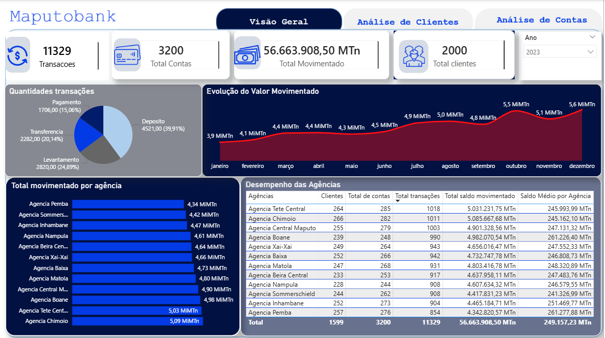
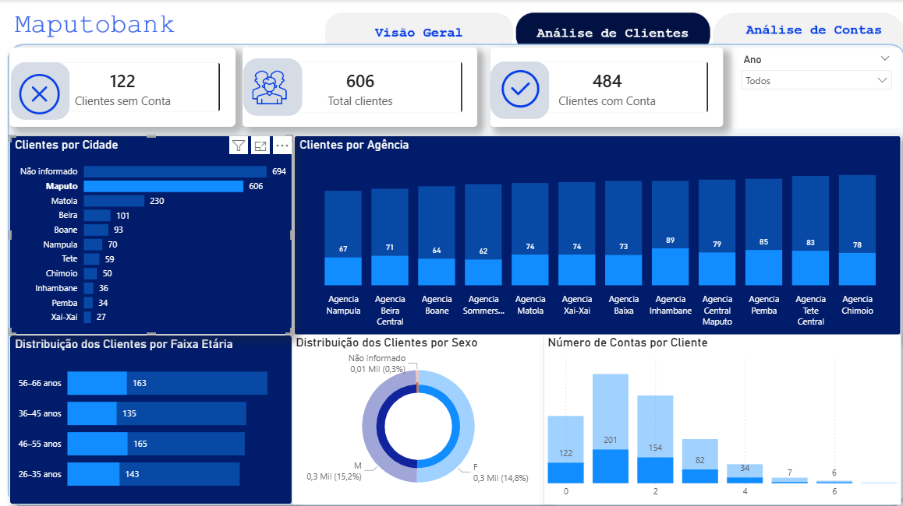
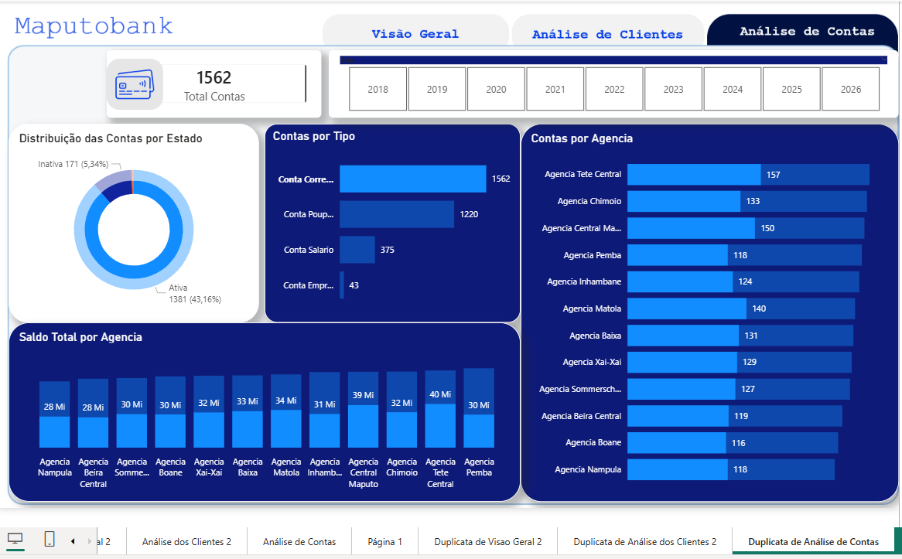

# MaputoBank — Análise de Dados Bancários

## Sobre o projecto

O **MaputoBank** é um projecto de análise de dados desenvolvido para transformar dados de clientes, contas bancárias, agências e movimentações financeiras em informação útil para o acompanhamento da actividade bancária.

O projecto simula uma necessidade de negócio: apoiar a gestão das agências e melhorar o acompanhamento dos resultados financeiros através de indicadores, análises e visualizações interactivas.

> **Nota:** Os dados utilizados neste projecto são sintéticos e destinam-se exclusivamente a fins de aprendizagem e demonstração técnica.

## Objectivos

- Analisar o perfil e a distribuição dos clientes.
- Avaliar a estrutura e o estado das contas bancárias.
- Analisar as movimentações financeiras por tipo, período e agência.
- Comparar indicadores de actividade entre agências.
- Desenvolver um dashboard interactivo para apoiar a análise e a tomada de decisão.

## Ferramentas utilizadas

| Ferramenta | Utilização |
|---|---|
| **PostgreSQL** | Exploração, validação e análise dos dados através de SQL |
| **Power Query** | Auditoria, tratamento e preparação dos dados |
| **Power BI** | Modelação, visualização e desenvolvimento do dashboard |
| **DAX** | Criação de medidas e indicadores analíticos |

## Processo de análise

1. Entendimento do problema de negócio
2. Estrutura e modelação dos dados
3. Auditoria e tratamento da qualidade dos dados
4. Análise de dados com SQL
5. Preparação e modelação no Power BI
6. Criação de medidas DAX
7. Desenvolvimento do dashboard
8. Conclusões e recomendações

## Principais indicadores

| Indicador | Resultado |
|---|---:|
| Clientes | 2.000 |
| Clientes com conta | 1.599 |
| Clientes sem conta | 401 |
| Contas bancárias | 3.200 |
| Transacções analisadas | 60.000 |
| Valor total movimentado | 300.344.315,81 |

A análise temporal das movimentações financeiras no dashboard está centrada no período de **2022 a 2025**.

## Dashboard

O dashboard foi organizado em três páginas:

### 1. Visão Geral

Apresenta os principais indicadores do banco, evolução do valor movimentado, transacções por tipo, valor movimentado por agência e desempenho das agências.

### 2. Análise de Clientes

Apresenta a distribuição dos clientes por sexo, agência, cidade e faixa etária, além da distribuição do número de contas por cliente.

### 3. Análise de Contas

Apresenta a distribuição das contas por agência, tipo e estado, bem como o saldo total por agência.

## Visualizações

### Visão Geral



### Análise de Clientes



### Análise de Contas



## Principais análises

O projecto permite analisar:

- distribuição e características dos clientes;
- clientes com e sem contas;
- distribuição das contas por agência, tipo e estado;
- quantidade e valor das movimentações financeiras;
- comportamento das movimentações ao longo do tempo;
- desempenho das agências;
- distribuição dos saldos entre agências.

## Estrutura do projecto

```text
MaputoBank/
├── README.md
├── Documentacao/
│   └── Projecto_MaputoBank.pdf
├── SQL/
│   └── principais_consultas.sql
├── PowerBI/
│   └── MaputoBank.pbix
└── Imagens/
    ├── visao_geral.png
    ├── analise_clientes.png
    └── analise_contas.png

## Documentação

A documentação completa do projecto apresenta:

- contexto e problema de negócio;
- estrutura e modelação dos dados;
- auditoria e tratamento da qualidade dos dados;
- análise SQL;
- preparação e modelação no Power BI;
- medidas DAX;
- desenvolvimento do dashboard;
- conclusões e recomendações.

## Possíveis melhorias

Como evolução futura, o projecto poderá incorporar:

- Incorporar novos indicadores de desempenho e rentabilidade.
- Integrar dados históricos de saldos para permitir análises temporais.
- Automatizar a actualização dos dados e dos indicadores.
- Expandir a análise de clientes e serviços bancários.

## Autor

**Mateus Pinto António**

Projecto desenvolvido para demonstrar competências em **análise de dados, SQL, preparação e modelação de dados, DAX e visualização com Power BI**.
